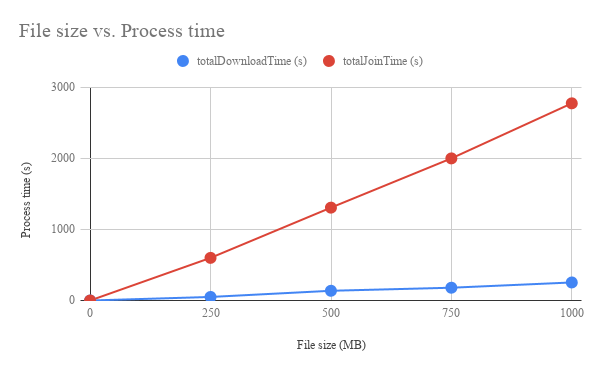

DownloadLargeFilesByUrl
=====

# Overview
**DownloadLargeFilesByUrl is a GAS library for downloading large files from URL to Google Drive using Google Apps Script (GAS).**

# Description
I had been thinking of about whether a large file from an URL can be downloaded to Google Drive using GAS. When I have tried to download such large files, I noticed the following limitations. These limitations are due to the specification of GAS.

- When users download a file from URL using GAS, at the most users, it retrieves the blob using ``UrlFetchApp.fetch(url).getBlob()`` and saves it as a file using ``DriveApp.createFile(blob)``. In this case, only files less than 50 MB (52,428,800 bytes) can be created, because of the size limitation of Blob. [Ref 1](#references)
- There are a limit executing time for Google Apps Script (GAS). That is 6 min/execution. [Ref 2](#references) And also G Suite Business accounts have 30 min/execution.

- There are a limit of total executing time for running scripts by triggers. That is 90 min/day. (Recently, it became from 60 min/day to 90 min/day.) [Ref 2](#references)

When it tries to create the application for downloading the large files, it is required to consider above limitations. On the other hand, there are the following relaxations of quotas by the recent Google's update.

- Quotes of URL Fetch response size and URL Fetch POST size became from  100 MB/day to 50 MB/call. [Ref 2](#references)
    - By this, I have been able to create a sample script for splitting large files in Google Drive. [Ref 3](#references)
- fetchAll method was added to the class UrlFetchApp.
    - It has been found that fetchAll method is worked by the asynchronous processing. [Ref 4](#references)

From these limitations and relaxed quotas, I could notice a direction for achieving it. I came up with the following flow.

1. When a large file is download from URL, the file is downloaded by splitting using the range to the header.
2. Use fetchAll method to download the file. Downloading is run by the asynchronous processing.
3. Use resumable upload to join the split data to the original file. Joining is run by the synchronous processing. Because the resumable upload has to be done by the synchronous processing.

I could create this library using the flow like this. If this was useful for you, I'm glad.

### References
1. [Resumable_Upload_For_WebApps](https://github.com/tanaikech/Resumable_Upload_For_WebApps)
2. [Current limitations at Quotas for Google Services](https://developers.google.com/apps-script/guides/services/quotas#current_limitations)
3. [Resumable Conversion from CSV File with Large Size (> 50 MB) to Several Spreadsheets by Splitting File](https://gist.github.com/tanaikech/3e44c779f05374d19333444c9a4dd5ba)
4. [Benchmark: fetchAll method in UrlFetch service for Google Apps Script](https://gist.github.com/tanaikech/c0f383034045ab63c19604139ecb0728)

# Library's project key
~~~
1PTlzn6VNux5MlnkT5zsb4T-UDLINCLFvK5Uvb0M4gstAt3P9eBHWxMCu
~~~

# How to install
1. [Install DownloadLargeFilesByUrl library](https://developers.google.com/apps-script/guides/libraries).
    - Library's project key is **``1PTlzn6VNux5MlnkT5zsb4T-UDLINCLFvK5Uvb0M4gstAt3P9eBHWxMCu``**.
1. Enable Drive API at API console
    - On script editor
    - Resources -> Cloud Platform project
    - View API console
    - At Getting started, click Enable APIs and get credentials like keys.
    - At left side, click Library.
    - At Search for APIs & services, input **Drive API**. And click Drive API.
    - Click Enable button.
        - If it has already been enabled, please don't turn off.

<u>Installing is done! You can use DownloadLargeFilesByUrl.</u>

> At the first run of the script using library, the authorization screen is displayed. Please authorize it. By this, you can use Drive API. This authorization is required to do for only the first run.

#### Scopes
This library uses the following 2 scopes.

~~~
https://www.googleapis.com/auth/drive
https://www.googleapis.com/auth/script.external_request
~~~

# Usage
## Methods
### 1. download(resource)
A sample script is as follows.

~~~javascript
var resource = {
    url: url,
    exportFolderId: "### folderId of downloaded file ###",
    tempFolderId: "### folderId of temp files ###",
    chunkSize: 51380224,
    downloadPerExecution: 4,
};
var res = DownloadLargeFilesByUrl.download(resource);
~~~

``resource`` is an object including the information for downloading the file.

- **url** : Direct link of file you want to download.
- **exportFolderId** : Folder ID of a folder that downloaded file is saved.
- **tempFolderId** : Folder ID of a folder that the split files which were downloaded from URL are created. The configuration file is also put in this folder.
- **chunkSize** : Size of each split file. Default value is 51380224 bytes. When this property is not used, the default value is used.
    - I think that this there might be no chance for modifying this property.
- **downloadPerExecution** : Number of workers for fetchAll. Default value is 4. This means that 4 files are downloaded by 1 fetchAll call. When this property is not used, the default value is used.
    - If you increase this value, please be careful the execution time of the script.

> **IMPORTANT!**

> **[The expiration of resumable upload is 1 week after ``get()`` method was run.](https://developers.google.com/drive/api/v3/resumable-upload#handling_errors)** So after the split files were completely downloaded and the join process was started, it is required to finish the join process in 1 week.

### 2. getStatus(resource)
A sample script is as follows.

~~~javascript
var resource = {
    tempFolderId: "### folderId of temp files ###",
};
var res = DownloadLargeFilesByUrl.getStatus(resource);
~~~

Retrieve the current condition of download in ``tempFolderId``.

## Flow of download
This is a flow that this library downloads a file.

- (1)
Run a following script. When the script was finished, you can retrieve "tempFolderId" as follows. After 2nd running, it uses "tempFolderId".

~~~javascript
var resource = {
    url: "### download URL ###",
};
var res = DownloadLargeFilesByUrl.download(resource);
var tempFolderId = res.tempFolderId;
~~~

- (2)
After 2nd running, please include "tempFolderId" in "resource" object, and run the script. By this, both the downloading and joining process are progressed.
    - When the download was completely done, ``{"message":"Download of file had already been done."}`` is returned.
    - If you want to retrieve the current condition of downloading, please use the getStatus method.

~~~javascript
var resource = {
    url: "### download URL ###",
    tempFolderId: tempFolderId,
};
var res = DownloadLargeFilesByUrl.download(resource);
~~~

## Sample script
This is a sample script which reflected above flow. When above flow is manually run, the process cost becomes very high. So this script is automated using the time trigger. This is a very simple sample. So please modify this for your situation.

When you use this script, please set ``url`` and ``exportFolderId``, and run ``main()``. By this, the trigger is automatically set and the script is run until the download is completed. If an error occurs

~~~javascript
function clearTrigger(functionName) {
  var triggers = ScriptApp.getProjectTriggers();
  triggers.forEach(function(e) {
    if (e.getHandlerFunction() == functionName) {
      ScriptApp.deleteTrigger(e);
    }
  });
}

function clearEnv(prop, functionName) {
  clearTrigger(functionName);
  prop.deleteProperty("tempFolderId");
}

function main() {
  var url = "###"; // Please set URL you want to download. This URL is required to be a direct link of the file.
  var exportFolderId = "###"; // Please set folder ID for saving the downloaded file.
  var email = "###"; // Please set email address. This is used for sending email when the download is completed and an error occurs.
  var functionName = "main"; // If you want to modify the function name, please also modify this.

  try {
    clearTrigger(functionName);
    var prop = PropertiesService.getScriptProperties();
    var tempFolderId = prop.getProperty("tempFolderId");
    var resource = {
      url: url,
      exportFolderId: exportFolderId,
      tempFolderId: tempFolderId || "",
    };
    var r = DownloadLargeFilesByUrl.download(resource); // Here, this library is used.
    if (!resource.tempFolderId) {
      prop.setProperty("tempFolderId", r.tempFolderId);
    }
    var t = new Date();
    t.setMinutes(t.getMinutes() + 3); // This means that the script run again after 3 minutes later.
    ScriptApp.newTrigger(functionName).timeBased().at(t).create();
    if (r.nextDownload == -1 && r.nextJoin == -1) {
      clearEnv(prop, functionName);
      MailApp.sendEmail({to: email, subject: "Download was completed.", body: JSON.stringify(r)});
    }
  } catch (e) {
    clearEnv(prop, functionName);
    MailApp.sendEmail({to: email, subject: "Error occurred.", body: JSON.stringify(e)});
  }
}
~~~

### Note
- In this sample script, the temporal folder and files are not deleted automatically. In this case, when it tries to download a file of 1 GB, the space of more than 2 GB is required in Google Drive.
    - About this, after the download of split files was completed, when the files are joined, the joined file can be deleted, after the file was joined. By this, the required space becomes the same to the file size.
- I think that when Web Apps is used for this library, it makes each user download the large files in each Google Drive using the browser and console.

## Configuration file for downloading
When the download is started, a configuration file is created in the temporal folder of ``tempFolderId``. You can see the folder as the folder name of "DownloadLargeFilesByUrl#####" (##### is number). This folder is used for saving the chunk files which were obtained by the split downloaded. And the configuration file of ``DownloadLargeFilesByUrl.cfg`` is also created in the folder. The structure of configuration file is as follows. This file is automatically created and used for downloading the file.

~~~
{
  "url": "### URL of file you want to download ###",
  "fileName": "### filename ###",
  "fileSize": 12345,
  "mimeType": "### mimetype ###",
  "exportFolderId": "### export folder ID ###",
  "nextDownload": -1,
  "nextJoin": -1,
  "chunks": [
    {
      "fileId": "### file ID of chunk file ###",
      "start": 0,
      "end": 51380223,  // Default one chunk is 51380224 bytes (49 MB)
    },
  ],
  "startDate": 12345,  // Start time of download. This is the unix time.
  "totalDownloadTime": 123, // Time used by downloading.
  "totalJoinTime": 123, //  Time used by joining. (resumable upload)
  "totalElapsedTime": 1234,  // totalDownloadTime + totalJoinTime
  "location": "###",  // Endpoint of resumable upload.
  "expirationOfLocation": 123456789  // Limitation time of location. Location can be used in 1 week.
}
~~~

- ``chunks`` is files obtained by the split download.
- When both ``nextDownload`` and ``nextJoin`` are ``-1``, it means that the download has already finished.
- When ``nextDownload`` and ``nextJoin`` are ``> -1`` and ``-1``, respectively, it means that the file is downloading from URL.
- When ``nextDownload`` and ``nextJoin`` are ``-1`` and ``> -1``, respectively, it means that the file is joining.
- ``expirationOfLocation`` is the limitation time of location. "Location" can be used in 1 week, after it was created. If this value is over, it is required to restart the joining process.

## Process time for downloading
I have tested several times the download of the large files using this library. Here, it is reported about the process time for downloading such large files. Figure 1 shows the file size vs. the process time. All files are downloaded from DropBox.

Fig. 1: File size (MB) vs. process time (s). Blue dots and red dots are totalDownlaodTime and totalJoinTime, respectively. These values can be seen at the configuration file of ``DownloadLargeFilesByUrl.cfg``.

 

From Fig. 1, it is found that for both values, the process time linearly increases with the increase in the file size. The cost of download process is much lower than that of join process. This is due to that the download process and the join process work by the asynchronous process and the synchronous process, respectively. The joining process (resumable upload) cannot carry out by the asynchronous processing. This is the specification of GAS.

For example, the average process time when a file with the size of 1 GB (1,073,741,824 bytes) is downloaded is shown below a table.

| Process | Time (s) |
|:---|---:|
| Total download time | 260 |
| Total Join time | 2,800 |
| Total process time including triggers | 9,000 |

The time used by the trigger is ``totalElapsedTime`` in the configuration file of ``DownloadLargeFilesByUrl.cfg``. In this case, it's 260 + 2800 = 3060 s. This means that when a file of 1 GB is downloaded using above sample script, the quotas of the trigger of more than 50 % is used.

# Appendix
- At first, when I tried to create this library, I had thought that I want to do alternately the split download and resumable upload. Namely, after a split data from URL is retrieved, the data is uploaded as a chunk of resumable upload. In this case, it is not required to create the temporal files. But when I carried out this flow, an error of "Out of memory error" always occurs. So I separated the downloading process and the joining process.
    - I have still not been able to resolve about this issue.

- This library uses 49 MB (51,380,224 bytes) as one default chunk. At UrlFetchApp, the data of 50 MB (52,428,800 bytes) can be retrieved by one call. But when the data of 50 MB is retrieved from URL using the range header, the file size is not 50 MB. This might be due to the response except for the file data. So I used 49 MB as a chunk.

-----

# Licence
[MIT](LICENCE)

# Author
[Tanaike](https://tanaikech.github.io/about/)

If you have any questions and commissions for me, feel free to tell me.

# Update History
* v1.0.0 (September 2, 2018)

    1. Initial release.

* v1.0.1 (December 5, 2018)

    1. When the filename have not been retrieved, an error have occurred. This bug was removed.

[TOP](#TOP)
